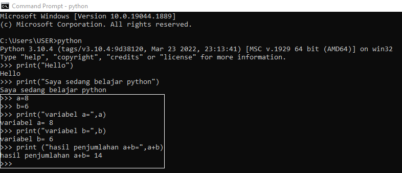

# lab2py

<strong>Repository ini dibuat untuk memenuhi tugas Pemrograman Web</strong>
| <strong>Nama</strong>      | <strong>Lydia Diffani Siregar</strong>  |
| ----------- | ----------- |
| <strong>NIM</strong>     | <strong>312010498</strong>       |
| <strong>Kelas</strong>   | <strong>TI.22.A.1</strong>       

# <strong>Latihan 1 "Menjalankan Python Console menggunakan CMD"</strong>
## • Menampilkan tulisan “Hello” dilayar.  • Menampilkan tulisan “Saya sedang belajar python” dilayar. 

# <strong>Latihan 2 "Menjumlahkan dua buah bilangan menggunakan variable a dan b."</strong>
## • Mendefinisikan variable a dengan nilai 8 • Mendefinisikan variable b dengan nilai 6 • Mencetak nilai variable a dan b • Mencetak hasil penjumlahan a+b 

# <strong>Latihan 3 "Menjalankan IDLE"
## • Membuat file baru dengan nama latihan3.py (pastikan lokasi file pada folder lab2py pada direktori kerja anda) • Menggunakan fungsi input untuk mengambil nilai variabel dari keyboard. 
